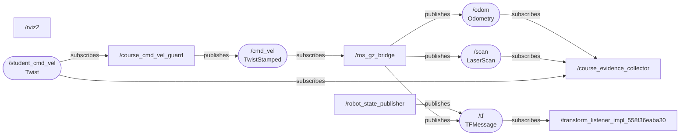

# Observed ROS 2 system diagram

This diagram is generated from the captured publisher and subscriber endpoints. A missing arrow records a missing live endpoint, not an assumed connection.

## Guided terminal observations

| Observation | Completed |
|---|---|
| Listed the running nodes | Yes |
| Inspected the command guard | Yes |
| Inspected the simulator bridge | Yes |
| Inspected the scan connections | Yes |
| Viewed one scan message | Yes |
| Compared proposed and approved command topics | Yes |
